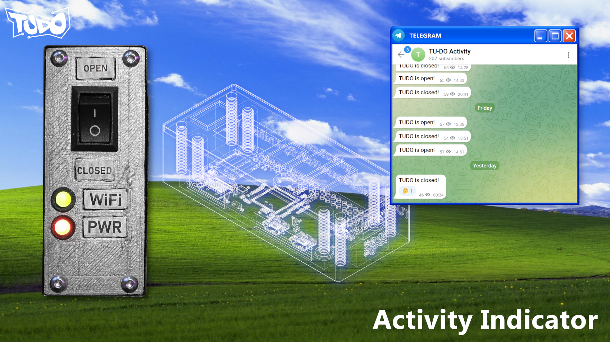

# TU-DO Activity Indicator <!-- omit in toc -->

A physical switch that informs everyone whether the TU-DO Makerspace is currently open or closed.



## Table of Contents <!-- omit in toc -->
- [Communication Channels](#communication-channels)
- [Overview](#overview)
- [Hardware - Building the Activity Indicator](#hardware---building-the-activity-indicator)
  - [Components](#components)
  - [Wiring](#wiring)
- [Software - Setting up the Activity Indicator](#software---setting-up-the-activity-indicator)
  - [Preparation](#preparation)
  - [An Overview of the Software](#an-overview-of-the-software)
    - [activity-indicator.py](#activity-indicatorpy)
    - [Telegram Bot](#telegram-bot)
  - [Configuring the software](#configuring-the-software)
    - [Setting up the main configuration file](#setting-up-the-main-configuration-file)
    - [Setting up the telegram bot](#setting-up-the-telegram-bot)
    - [Adding custom sub-processes](#adding-custom-sub-processes)
  - [Installation](#installation)

## Communication Channels

The following communication channels are currently offered to obtain infromation about the Makerspace's activity status:

 -  [TU-DO Activity Telegram Channel](https://t.me/+MW8nzEwFLuFiOGE0)

## Overview

The Acitivity Indicator arose from the need to inform the public about the current activity status of the Makerspace, especially during times where we cannot maintain strict opening times.

The hardware behind the Activity Indicator consists of a Raspberry Pi Zero W, along with two status LEDs: One red LED indicating power, and one multicolor red and green LED indicating whether a internet connection is available (green if available, red if not).
On top of the Raspberry Pi Zero W, a systemd service is installed which monitors and handles the activity switch and continuously checks the internet connection.

The software is by no means limited to work for applications of the TU-DO Makerspace only! It can be configured to practially execute whichever commands desired upon switch events. Even sub-processes found within this repo, such as [the script used to send a Telegram message](software/telegram), can be configured to operate for any chat with a configurable message for opening and closing events each

A more detailed overview of the hardware and software, along with how to build and set-up your very own activity indicator is provided in the upcoming sections.

## Hardware - Building the Activity Indicator

### Components

The following components are required to build the Activity Indicator:

- A Switch
- Any Linux capable Raspberry Pi board (We use the Pi Zero W)
- A red LED for the power status
- A multi-color common red and green LED for the internet connection indicator (Alternatively two seperate red and green LEDs can be used)
- 1x 1k Ohm resistor for the power LED
- 1x 100 Ohm resistor for the connection indicator LED

### Wiring

- The Power LED, along with its 1k resistor in series, is connected to one of the Raspberry Pi's 5V pins.
- The pins of the connection indicator LED are connected any of the Raspberry Pi's GPIO pins. Ensure the common ground pin has a 100 Ohm resistor connected in series. 
- For the Switch, one end is connected to the Raspberry Pi's GPIO pin, and the other end is connected to one of the RPI's ground pins.

One possible configuration for the Raspberry Pi Zero W is shown below:


As already mentioned above, the Activity Indicator is not limited to the Pi Zero W only. Any other Linux capable Raspberry Pi boards can be used as well. Which GPIOs are used for the switch and the connection indicator LED is up to the user, as those will later be configured in the software.

Once the software for the activity indicator has been set up and is good to go (see next section), it is recommended to place the hardware into a solid enclosure.

## Software - Setting up the Activity Indicator

### Preparation

If your Raspberry Pi is not already set up with a OS, make sure to install one first. Since the Activity Indicator has been written with RPi OS Bullseye in mind, this guide will assume that [RPi OS Bullseye](https://www.raspberrypi.com/software/operating-systems/) is installed. If you are using a different OS, you may need to take extra steps on your own to get things up and running. 

Once the OS has been installed, and an active internet connection has been established, ensure git has been installed:
```
$ sudo apt install git
```

Proceed to clone the repo into your Pi's home directory (Or anywhere else), and enter the project directory:
```
$ cd ~ && git clone https://github.com/TU-DO-Makerspace/Activity-Indicator && cd Activity-Indicator
```

To install the necessary software dependencies, run the setup.sh script with the dependencies option:
```
$ sudo ./setup.sh dependencies
```

This will install all required apt packages and python modules.

### An Overview of the Software

> Note: This section can be skipped if your only goal is to set up the software. 

This section will briefly provide an overview of the software behind the activity-indicator.

#### activity-indicator.py

The activity indicator software primarily driven by the [acitvity-indicator.py](software/activity-indicator.py) script, whose primary job is to monitor and handles changes in the activity switch. It is launched as a systemd service and continously runs in the background.

When a change in the activity switch has been detected, the script will execute all sub-processes defined in the [activity-indicator.ini](software/activity-indicator.ini) configuration file assigned to the committed action (open or closed). Each sub-process defined in the configuration file can contain a command which should be executed upon setting the switch into its opening position (`OpenExec`) and closing position (`ClosedExec`). Setting up the configuration file is explained in the ["Configuring the software" section](#configuring-the-software).     

The script is also responsible for checking whether an internet connection is available, which in return sets the color of the connection indicator LED. Should no internet connection be available, the programm is halted and returns to execution as soon as a connection is established again. If the switch position is changed while no internet connection is available, the change will be registered as soon as the connection has been established again.

Unexpected errors are also handled: Should an unexpected error occur during execution, the script will print an error message and blinks the connection LED green and red 3 times. The systemd service unit for the script, [activity-indicator.service](software/systemd/activity-indicator.service), is configured to automatically restart the script after it has exited, meaning the script must not be manually started again after a crash or unexpected exit.

#### Telegram Bot

The scripts and configuration files to run a telegram bot can be found in the [software/telegram](software/telegram) folder.

The [telegram-activity-indicator.py](software/telegram/telegram-activity-indicator.py) script is responsible for sending
an opening and closing message to one or more chats. Chats, along with their opening and closing messages can be configured in the [telegram.ini](software/telegram/telegram.ini) configuration file. Setting up the configuration file is explained in the ["Configuring the software" section](#configuring-the-software).

The script takes a path to a configuration file (`-c`, if not specified, set to `telegram.ini`) and a activity status (`open` or `closed`) as an argument. It also offers you to set the log level using the `-l` flag, which is set to `INFO` if left out.
The full script usage can be printed by providing it the `-h` option.

While [telegram-activity-indicator.py](software/telegram/telegram-activity-indicator.py) script can be executed manually, it has been written with the intention of being executed by the activity-indicator service in mind. Should you want to make use of a telegram bot, then [telegram-activity-indicator.py](software/telegram/telegram-activity-indicator.py) must be specified in the [activity-indicator.ini](software/activity-indicator.ini) configuration file. The default [activity-indicator.ini](software/activity-indicator.ini) provided in this repo is already set to do that.

### Configuring the software

#### Setting up the main configuration file

The first step is to configure the main activity-indicator configuration file, which can be found at [software/activity-indicator.ini](software/activity-indicator.ini). By default the configuration file will contain the following content:

```
; Change this to your hardware configuration
[GPIO]
Switch = 16
ConLEDGreen = 20
ConLEDRed = 21

[telegram]
OpenExec = /usr/bin/python3 /usr/share/pyshared/activity-indicator/telegram/telegram-activity-indicator.py -c /var/lib/activity-indicator/telegram.ini open
ClosedExec = /usr/bin/python3 /usr/share/pyshared/activity-indicator/telegram/telegram-activity-indicator.py -c /var/lib/activity-indicator/telegram.ini closed

; [your_subservice_name]
; OpenExec = COMMAND TO RUN WHEN ACTIVITY HAS CHANGED TO OPEN
; ClosedExec = COMMAND TO RUN WHEN ACTIVITY HAS CHANGED TO CLOSED
```

Make sure to assign the correct GPIOs to your own configuration if they do not already match the ones above.

The `[telegram]` section provides the commands to execute the telegram-bot sub process. If you do not wish to use a telegram bot for the activity indicator, comment out or remove this entry.

Adding additional sub-processes is elaborated further in the ["Adding custom sub-processes" section](#adding-custom-sub-processes) below. 

#### Setting up the telegram bot

> Note: Skip this section if you're not planning to use a telegram bot.

First, create a telegram bot if you have not done so already. To create a new bot, you will have to message the BotFather (See https://core.telegram.org/bots#6-botfather).

Once the bot has been created, open the [telegram.ini configuration file](software/telegram/telegram.ini), located at [software/telegram/telegram.ini](software/telegram/telegram.ini), which should contain the following content:

```
[bot]
Token = INSERT YOUR BOT TOKEN HERE

[chat1] # Can be named anything except 'bot'
ChatID = INSERT YOUR CHAT ID HERE
OpenMessage = INSERT YOUR OPEN MESSAGE HERE
ClosedMessage = INSERT YOUR CLOSED MESSAGE HERE

; [chat2]
; ChatID = INSERT YOUR CHAT ID HERE
; OpenMessage = INSERT YOUR OPEN MESSAGE HERE
; ClosedMessage = INSERT YOUR CLOSED MESSAGE HERE

# Add more if necessary
```

In the bot section, specify the token of the bot you created. You should have received this token from the BotFather upon creating your bot.

Next up, you will need to specify the target chats that should be notified of the activity change. You can add as many chats as you want and name them anything except 'bot'. Each chat section takes a chat ID (`ChatID`, [see this stack overflow thread to learn how to get the ID of a chat](https://stackoverflow.com/questions/32423837/telegram-bot-how-to-get-a-group-chat-id)), the message to send when the activity has changed to open(`OpenMessage`) and the message to send when the activity has changed to closed (`ClosedMessage`).

An example configuration could look like this:
```
[bot]
Token = 110201543:AAHdqTcvCH1vGWJxfSeofSAs0K5PALDsaw

[TUDO Activity Indicator]
ChatID = -1001512093131
OpenMessage = TUDO is open!
ClosedMessage = TUDO is closed!
```

#### Adding custom sub-processes

Adding a custom sub process is as simple as adding a new section to the activity-indicator configuration file. The section name should describe the sub-process, and the commands to execute should be specified in the `OpenExec` and `ClosedExec` entries.

Where to store your sub-process program or script is up to you.

As an example, suppose we wish to save the current time every time the activity changes. We can add the following lines to the configuration file:

```
[time]
OpenExec = echo "Opened: $(date)" >> ~/opening_times.txt
ClosedExec = echo "Closed: $(date)" >> ~/closing_times.txt
```

### Installation

After configuring the software, simply execute the setup script at the top of the project directory, with the `install` option provided:

```
$ sudo ./setup.sh install
```

The activity indicator should now be alive and running! Should it not be working correctly, please check the systemd log for any possible errors using the following command:

```
$ journalctl -f -u activity-indicator.service
```

Also ensure to double check wether your GPIO's are really set correctly.

To update the softare after applying changes, simply execute the setup script with the `install` option again.

To uninstall the software, simply execute the setup script with the `uninstall` option:


```
$ sudo ./setup.sh uninstall
```